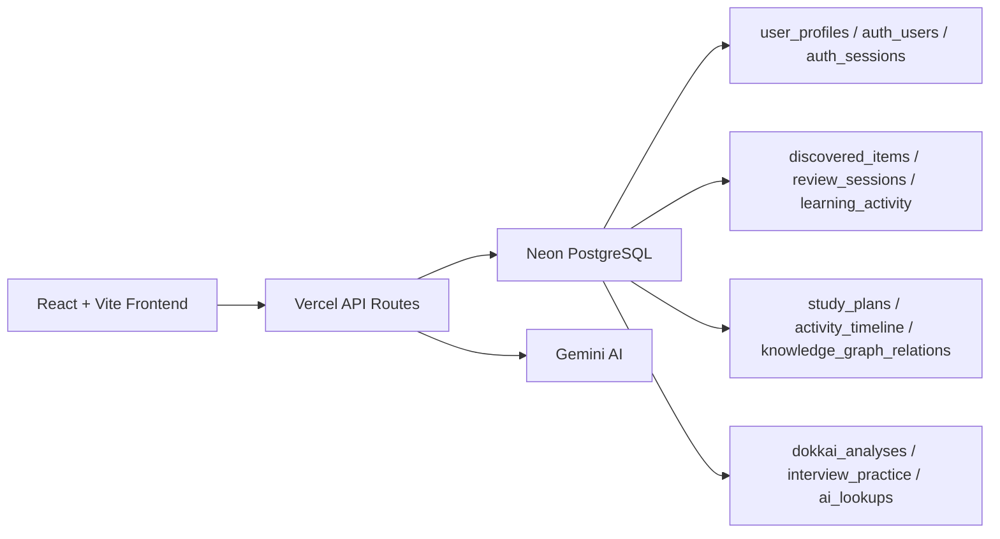

# KOTOBA SEVEN

**AI-Powered Japanese Learning Intelligence Platform** for JLPT/NAT preparation, interview readiness, and daily guided study execution.

## Product Positioning

Kotoba Seven is no longer a static learning dashboard. It is an **intelligence layer** that answers:

- Where am I now?
- What should I do today?
- What am I struggling with?
- How close am I to my goal?

## Core Platform Modules

- **Dashboard Storytelling**: readiness, streak, daily goal, AI study plan, recommendation panel, activity feed.
- **AI Word Intelligence (Lookup)**: bilingual insights, usage notes, save-to-knowledge-base flow.
- **My Discovered**: searchable knowledge base with bulk actions, AI tags, clustering, exports.
- **Review Mode**: spaced repetition with retention/session metrics.
- **Dokkai Analyzer**: JLPT estimate, difficulty score, reading speed estimate, extracted decks.
- **Interview Coach**: role-based coaching with score breakdown and progress tracking.
- **Analytics 2.0**: weekly/monthly/custom trends with AI usage and readiness reports.
- **Learning Intelligence 2.0**: weak-area analysis, pattern analysis, study efficiency metrics.
- **Kotoba Sensei**: AI copilot connecting all learning modules.
- **Learning Timeline**: chronological activity stream.
- **Knowledge Graph**: vocabulary/kanji/grammar relation visualization.

## Architecture



## Neon Database Architecture

Primary data tables:

- `users` (via `auth_users`)
- `user_profiles`
- `discovered_items`
- `learning_activity`
- `review_sessions`
- `dokkai_analyses`
- `interview_practice`
- `ai_lookups`
- `study_plans`
- `activity_timeline`
- `knowledge_graph_relations`

Neon is the **source of truth**. `localStorage` is used only for guest/cache/legacy import fallback.

## AI Modules

- `/api/ai-lookup` - AI word intelligence + lookup history
- `/api/analyze-dokkai` - reading analysis + extracted decks
- `/api/interview-coach` - interview coaching + score decomposition
- `/api/intelligence` - learning intelligence, study plan, timeline, copilot, knowledge graph actions

## Tech Stack

- React 19 + Vite 7
- Tailwind CSS v4
- Framer Motion
- React Router
- Recharts
- Vercel Serverless Functions
- Neon PostgreSQL (`@neondatabase/serverless`)
- Gemini API

## Environment Variables

| Variable | Required | Description |
|----------|----------|-------------|
| `DATABASE_URL` | Yes | Neon Postgres connection string (server-side only) |
| `GEMINI_API_KEY` | Yes | Gemini API key for AI modules |
| `SKIP_DB_BOOTSTRAP` | No | Set `1` to skip auto schema bootstrap |

## Quick Start

```bash
git clone https://github.com/iamhimanshu26/MyJapaneseJourney.git
cd MyJapaneseJourney
npm install
cp .env.example .env
# Add DATABASE_URL and GEMINI_API_KEY
npm run dev
```

## Deployment (Vercel)

```bash
npx vercel --prod
```

Set env vars in Vercel Project Settings:

- `DATABASE_URL`
- `GEMINI_API_KEY`

## Roadmap

- **Phase 1**: Dashboard storytelling, demo workspace mode, study planner, timeline
- **Phase 2**: Kotoba Sensei, knowledge graph, vocabulary clustering
- **Phase 3**: Dokkai/Interview enhancements, Analytics 2.0, Learning Intelligence 2.0
- **Phase 4**: Settings and UX/performance polish

## Related Docs

- `docs/NEON-SETUP.md`
- `docs/neon-schema.sql`
- `docs/PLAN.md`

## License

MIT
